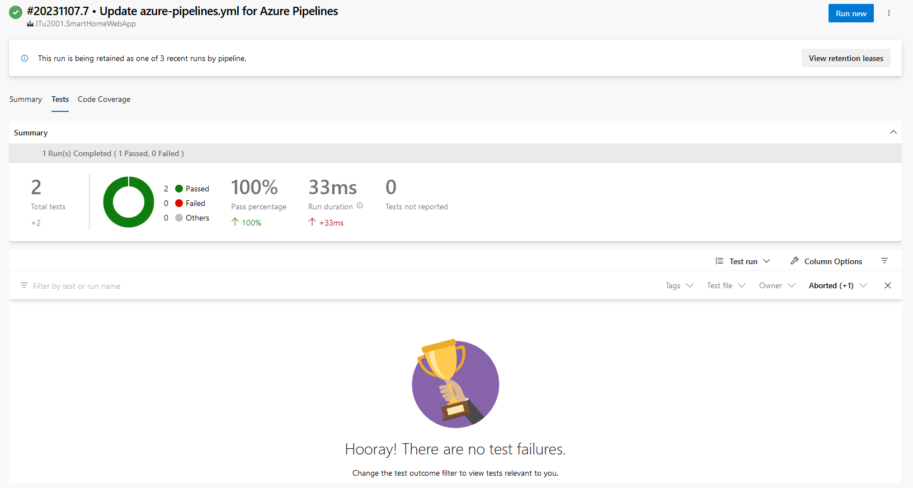
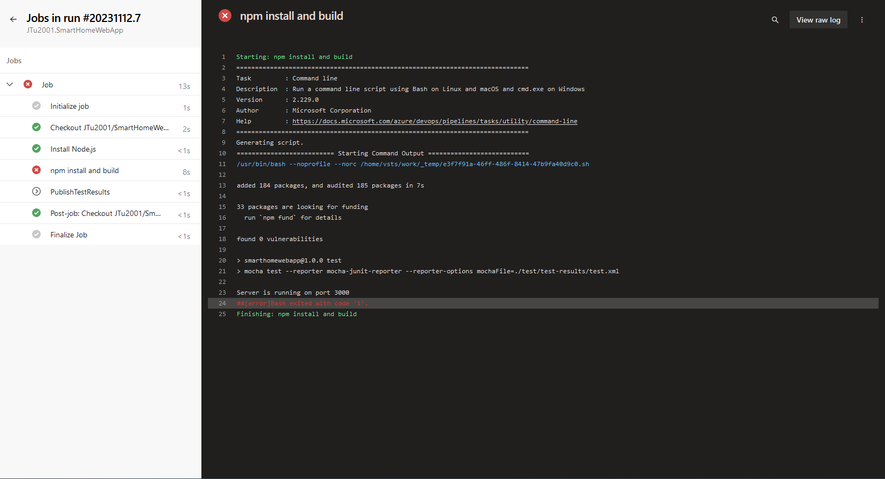
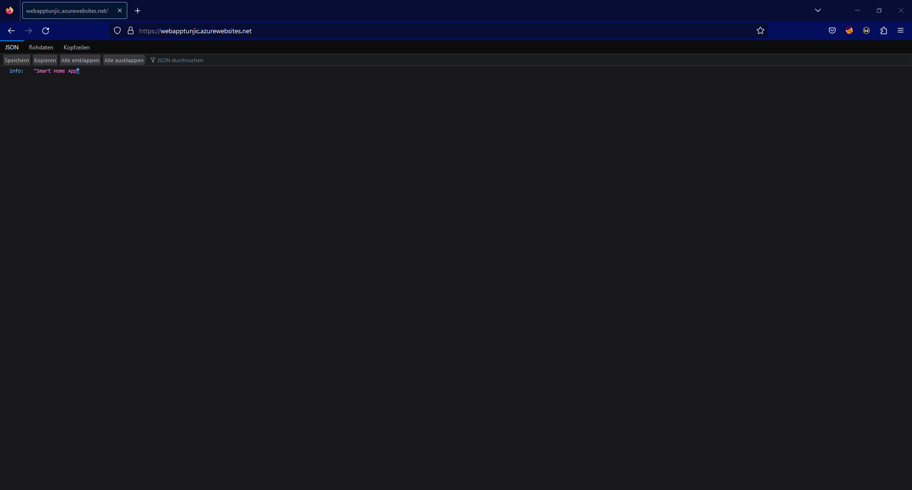

# Links
Link zum Repo: https://github.com/JTu2001/SmartHomeWebApp

# Test Pipeline
```
# Node.js
# Build a general Node.js project with npm.
# Add steps that analyze code, save build artifacts, deploy, and more:
# https://docs.microsoft.com/azure/devops/pipelines/languages/javascript

trigger:
- main

pool:
  vmImage: ubuntu-latest

steps:
- task: NodeTool@0
  inputs:
    versionSpec: '18.x'
  displayName: 'Install Node.js'

- script: |
    npm install 
    npm run test
  displayName: 'npm install and build'

- task: PublishTestResults@2
  inputs:
    testResultsFormat: 'JUnit'
    failTaskOnFailedTests: true
    testResultsFiles: '**/test.xml'
```

Hier ein Beispiel von ein erfolgreichen Test:


Bei fehlgeschlagengen Test entsteht folgender Fehler:



# Release Pipeline
```
# Node.js
# Build a general Node.js project with npm.
# Add steps that analyze code, save build artifacts, deploy, and more:
# https://docs.microsoft.com/azure/devops/pipelines/languages/javascript

trigger: none

pool:
  vmImage: ubuntu-latest

steps:
- task: NodeTool@0
  inputs:
    versionSpec: '18.x'
  displayName: 'Install Node.js'

- script: |
    npm install
  displayName: 'npm install and build'

- task: AzureWebApp@1
  inputs:
    azureSubscription: 'Azure for Students(5be317d1-ce90-47cb-8ab6-2bbe753aa639)'
    appType: 'webAppLinux'
    appName: 'webapptunjic'
    package: '$(System.DefaultWorkingDirectory)/**/*.zip'
```
Release der WebApp:



