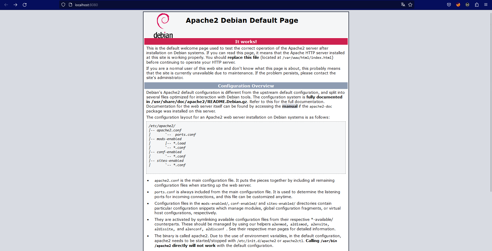

# 1. Inhaltsverzeichnis
- [1. Inhaltsverzeichnis](#1-inhaltsverzeichnis)
- [2. Teil 1](#2-teil-1)
  - [2.1. Vorbereitung - Container aufsetzen](#21-vorbereitung---container-aufsetzen)
  - [2.2. Setup MySQL Datenbank](#22-setup-mysql-datenbank)
    - [2.2.1. Test der DB](#221-test-der-db)
  - [2.3. Setup Wordpress](#23-setup-wordpress)
  - [2.4. Container stoppen](#24-container-stoppen)
- [3. Teil 2](#3-teil-2)
  - [3.1. Erstellung MySQL-Image](#31-erstellung-mysql-image)
    - [3.1.1. Test - Datenbank erstellt](#311-test---datenbank-erstellt)
  - [3.2. Erstellung Wordpress-Image](#32-erstellung-wordpress-image)
  - [3.3. Erstellung des Docker-Compose File](#33-erstellung-des-docker-compose-file)
- [4. Quellen](#4-quellen)

# 2. Teil 1

Dieses Kapitel beschäftigt sich mit `Teil 1` der Aufgabe. Hierbei soll ein `docker-compose`-File erstellt werden welche Wordpress und MySQL images verwendet um eine Wordpress Container infrastruktur aufzusetzen. 

## 2.1. Vorbereitung - Container aufsetzen

Als erstes muss ein File mit dem Namen `docker-compose.yml` erstellt werden. Das `docker-compose.yml`-File hat folgende Struktur (Kommentare in YAML mittels `#`):
```YAML
version: 3 # Hier steht die Version

services: # Hier befinden sich die Services

volumes: # Hier können Volumes angeführt werden 
``` 

## 2.2. Setup MySQL Datenbank

Dieses Kapitel beschäftig sich mit dem Aufsetzen der MySQL Datenbank mittels `docker compose`.
Hierzu soll ein service in das `docker-compose.yml`-File eingefügt werden.
```YAML
version: '3'

services: 
  # MySQL Database
  db_mysql: 
    image: mysql:latest
    container_name: mysql_db
    ports:
      - '3306:3306'
    restart: unless-stopped
    environment:
      - MYSQL_ROOT_PASSWORD=password
      - MYSQL_USER=user
      - MYSQL_PASSWORD=password
      - MYSQL_DATABASE=wordpress
    volumes:
      - mysql-data:/var/lib/mysql

volumes:
  mysql-data:
```
Nähere Informationen zum Image befindet sich [hier](https://hub.docker.com/_/mysql).

Um ein Container gemäß der `docker-compose.yml` Konfiguration zu erstellen, muss folgender Befehl ausgeführt werden:
```
docker-compose up -d
```
Hier eine kurze Beschreibung vom Befehl:
- `docker-compose up`: Erstellung und Starten des Containers.
- `-d`: Detached-Modus: Container werden im Hintergrund ausgeführt.

<span style="color:lime"> Hinweis: Docker Desktop muss im Hintergrund aktiv sein. </span>

Nach der Ausführung des Befehls sollte der Container im Hintergrund laufen (Alternativ: `docker ps`):
<p align="center">
  
</p>


### 2.2.1. Test der DB

Um zu überprüfen ob die Datenbank läuft kann folgender Befehl ausgeführt werden

```
docker exec -it mysql_db mysql -u user -p
```
Hier eine kurze Beschreibung vom Befehl:
- `docker exec`: Befehl innerhalb des Containers ausführen.
- `-it`: Für eine interakive Session
- `mysql_db`: Name des Containers (hier: mysql_db => siehe YAML-File)
- `mysql -u user -p`: Der Befehl, der innerhalb des Containers ausgeführt wird (hier: Verbinde dich mit dem Benutzer `user` und einen Passwort). 

Anschließend wird man aufgefordert das Passwort einzugeben (Definiert unter environment => hier: password).

Anschließend kommt man zum `MySQL monitor`:

<p align="center">
  
</p>

Um zu überprüfen, ob die `wordpress`-Datenbank auch existiert, kann folgender Befehl ausgeführt werden:
```SQL
SHOW DATABASES;
```
Die Ausgabe sollte wie folgt sein:
<p align="center">
  
</p>

## 2.3. Setup Wordpress

Dieses Kapitel beschäftig sich mit dem Aufsetzen der MySQL Datenbank mittels `docker compose`.
Hierzu soll ein service in das `docker-compose.yml`-File eingefügt werden.
```YAML
version: '3'

services: 
  # MySQL Database
  db_mysql: 
    image: mysql:latest
    container_name: mysql_db
    ports:
      - '3306:3306'
    restart: unless-stopped
    environment:
      - MYSQL_ROOT_PASSWORD=password
      - MYSQL_USER=user
      - MYSQL_PASSWORD=password
      - MYSQL_DATABASE=wordpress
    volumes:
      - mysql-data:/var/lib/mysql
    
  # Wordpress
  wordpress:
    image: wordpress:latest
    container_name: wordpress_web
    ports: 
      - '8080:80'
    environment:
      - WORDPRESS_DB_HOST=db_mysql:3306
      - WORDPRESS_DB_USER=user
      - WORDPRESS_DB_PASSWORD=password
      - WORDPRESS_DB_NAME=wordpress
    volumes:
      - wordpress-data:/var/www/html
      
volumes:
  mysql-data:
  wordpress-data:
```

Nähere Informationen zum Image befindet sich [hier](https://hub.docker.com/_/wordpress).

Anschließend muss erneut folgender Befehl ausgeführt werden um den Container zu starten:
```
docker-compose up -d
```
Nach der Ausführung sollten beide Container laufen (Alternativ: `docker ps`):

<p align="center">
  
</p>

Wordpress sollte nun unter [http://localhost:8080](http://localhost:8080) erreichbar sein.

<p align="center">
  
</p>

Anschließend muss man eine Sprache auswählen.

<p align="center">
  
</p>

Danach muss man benötigte Informationen für die Webseite angeben.

<p align="center">
  
</p>

Nachdem den Installationsprozess durchgeführt wurde, muss man sich anmelden.
Anschließend wird man zu dashboard weitergeleitet.

<p align="center">
  
</p>

## 2.4. Container stoppen
```
docker-compose stop
```
Dieser Befehl stoppt alle Container.

# 3. Teil 2

Dieses Kapitel beschäftigt sich mit `Teil 2` der Aufgabe. Hierbei sollen eigene Images erstellt werden.

## 3.1. Erstellung MySQL-Image

Für die Erstellung von einen Image wird ein sogennante `Dockerfile` benötigt.
Das `Dockerfile` für MySQL könnte unter anderem wie folgt aussehen:

```Dockerfile
# Base Image
FROM debian:buster

# Environment variables
ENV MYSQL_ROOT_PASSWORD=root
ENV MYSQL_USER=user
ENV MYSQL_PASSWORD=password
ENV MYSQL_DATABASE=wordpress

# Install MariaDB Server
RUN apt-get update
RUN apt-get install -y mariadb-server 
RUN rm -rf /var/lib/apt/lists/*

# Create Directoty & Grant Access
RUN mkdir -p /var/run/mysqld /var/lib/mysql
RUN chmod 1777 /var/run/mysqld /var/lib/mysql

# Define Volume
VOLUME /var/lib/mysql/

# Init Database
RUN service mysql start \
    && mysqladmin -uroot password $MYSQL_ROOT_PASSWORD \
    && mysql --user=root --password=$MYSQL_ROOT_PASSWORD -e "CREATE DATABASE IF NOT EXISTS ${MYSQL_DATABASE};" \
    && mysql --user=root --password=$MYSQL_ROOT_PASSWORD -e "GRANT ALL PRIVILEGES ON ${MYSQL_DATABASE}.* TO '${MYSQL_USER}'@'%' IDENTIFIED BY '${MYSQL_PASSWORD}';" \
    && mysql --user=root --password=$MYSQL_ROOT_PASSWORD -e "FLUSH PRIVILEGES;"

# Expose port to 3306/tcp
EXPOSE 3306/tcp

# Run Command
CMD "mysqld"
```
Als Basis-Image wurde `debian` genommen. Danach wurden mittels `ENV` die Umgebungsvariablen definiert nach (`key=value`)-Pairs. Anschließend wird der `mariadb-server` mittels `apt` installiert. Für die Datenbank muss ein Verzeichnis angelegt werden. Das Volume wird mittels `VOLUME` definiert. Danach wird die Datenbank aufgesetzt und die Berechtigungen vergeben. Damit die Container 'nach außen' kommunizieren wird der `PORT` `3306/TCP` ausgesetzt. Zu guter Letzt wird der Befehl `mysqld` ausgeführt.

Nach dem das Dockerfile erstellt wurde kann das Image gebuildet werden mittels:
```
docker build -t mysql-database .
```
Hier eine kurze Beschreibung vom Befehl:
- `docker build`: Builden des Images
- `-t mysql-database`: Image-Tag (hier: mysql_database)
- `.` : Pfad zum `Dockerfile`. Achtung Verzeichnis! Der `.` repräsentiert das aktuelle Verzeichnis.

<span style="color:lime"> Hinweis: Sofern sich das Dockerfile ändert miss dass Image neu gebaut werden. </span>

<p align="center">
  
</p>

Um ein Container mit den erstellten Image zu erstellen wird folgender Befehl verwendet: 
```
docker run -d -p 3306:3306 --name mysql-container mysql-database
```
Hier eine kurze Beschreibung vom Befehl:
- `docker run`: Zur Erstellung und Ausführung des Containers
- `-d`: Detached-Modus: Container werden im Hintergrund ausgeführt.
- `-p 3306:3306`: Port Mapping von 3306 auf 3306
- `--name mysql-container`: Der Name vom Container
- `mysql-database`: Das Image als Fundament für den Container.

Dannach sollte der Container aktiv sein. Um den Container auszuführen wird folgender Befehl verwendet:
```
docker exec -it mysql-container mysql -uroot -p  
```
Hier eine kurze Beschreibung vom Befehl:
- `docker exec`: Führe den Container aus
- `-it`: Interaktiver Modus
- `mysql-container`: Name des Containers

Nach der Einabe des Passworts, kann der `MariaDB monitor` verwendet werden.

### 3.1.1. Test - Datenbank erstellt
Um zu verifizieren ob die Datenbank erstellt wurde muss folgender Befehl in `MariaDB` verwendet werden 
```SQL
SHOW DATABASES;
```
Die Ausgabe sollte wie folgt sein:

<p align="center">
  
</p>

## 3.2. Erstellung Wordpress-Image

Auch hier ist ein eigenes `Dockerfile` zu erstellen: 

```Dockerfile
# Base Image
FROM debian:buster

# Environment variables
ENV WORDPRESS_DB_HOST=localhost:3306
ENV WORDPRESS_DB_USER=user
ENV WORDPRESS_DB_PASSWORD=password
ENV WORDPRESS_DB_NAME=wordpress
ENV DEBIAN_FRONTEND noninteractive

# Install Packages 
RUN apt-get update && \
    apt-get install -y \
    apache2 \
    libapache2-mod-php \
    php \
    php-curl \
    php-gd \
    php-mbstring \
    php-mysql \
    php-xml \
    php-xmlrpc \
    unzip \
    wget \
    && rm -rf /var/lib/apt/lists/*

# Set Working Directory
WORKDIR /var/www/html

# Setup Website
RUN wget -O wordpress.zip https://wordpress.org/latest.zip && \
    unzip wordpress.zip && \
    rm wordpress.zip && \ 
    chown -R www-data:www-data /var/www/html

# Define Volume 
VOLUME /var/www/html

# Expose Port to 80/tcp
EXPOSE 80/tcp

# Runn Command
CMD ["/usr/sbin/apache2ctl", "-D", "FOREGROUND"]
```

Dannach wird wie vorhin das Image erstellt mittels (wobei hier der Image-Name `wordpress_web` ist):
```
docker build -t wordpress_web .
```

<p align="center">
  
</p>

Anschließend kann der Container mit dem erstelleten Image erstellt werden (hier kein Containername angegeben):
```
docker run -p 8080:80 -v wordpress-data:/var/www/html/wp-content wordpress_web
```

<p align="center">
  
</p>


Die Seite kann unter [http://localhost:8080/](http://localhost:8080/) erreicht werden.

<p align="center">
  
</p>


## 3.3. Erstellung des Docker-Compose File

Docker-Compose Files helfen dabei, mehrere Containerinstanzen zu erstellen. Nachfolgend befindet sich das `docker-compose`-File welches die vorhin erstellten Images verwendet.

```YAML
version: '3'

services:
  wordpress:
    image: wordpress_web:latest  
    ports:
      - "8080:80"
    volumes:
      - wordpress-data:/var/www/html/wp-content
    depends_on:
      - mariadb

  mariadb:
    image: mysql-database:latest  
    environment:
      MYSQL_ROOT_PASSWORD: root
      MYSQL_USER: user
      MYSQL_PASSWORD: password
      MYSQL_DATABASE: wordpress
    volumes:
      - mariadb-data:/var/lib/mysql

volumes:
  wordpress-data:
  mariadb-data:
```

Mittels `docker-compose up -d` können die Container gestartet werden: 

<p align="center">
  
</p>

# 4. Quellen
Docker-Hub: [https://hub.docker.com/](https://hub.docker.com/)

MySQL-Image: [https://hub.docker.com/_/mysql](https://hub.docker.com/_/mysql)

Wordpress-Image: [https://hub.docker.com/_/wordpress](https://hub.docker.com/_/wordpress)

Debian-Image: [https://hub.docker.com/_/debian/](https://hub.docker.com/_/debian/)

Tutorial MySQL: [https://www.digitalocean.com/community/tutorials/how-to-install-linux-apache-mysql-php-lamp-stack-on-ubuntu-16-04](https://www.digitalocean.com/community/tutorials/how-to-install-linux-apache-mysql-php-lamp-stack-on-ubuntu-16-04)

Tutorial Wordpress: [https://www.digitalocean.com/community/tutorials/how-to-install-wordpress-with-lamp-on-ubuntu-16-04](https://www.digitalocean.com/community/tutorials/how-to-install-wordpress-with-lamp-on-ubuntu-16-04)
