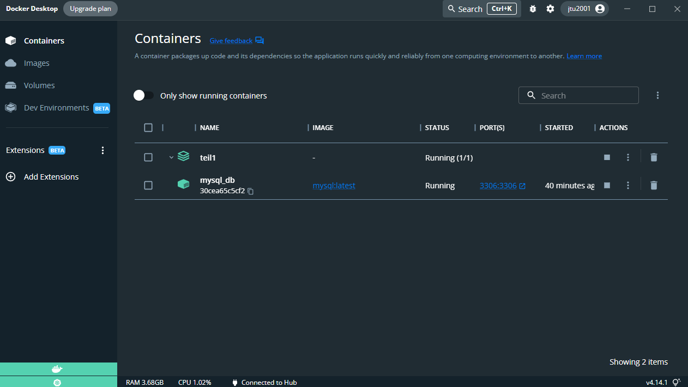
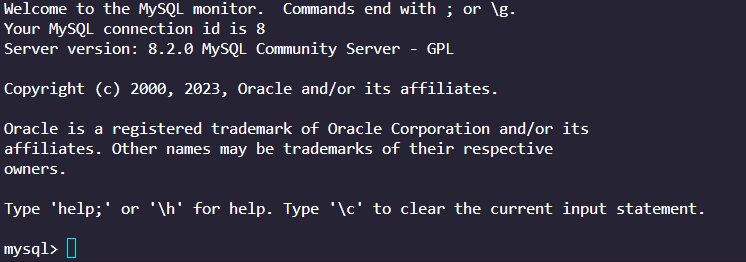
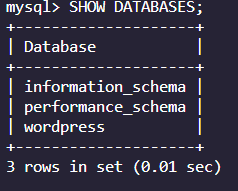
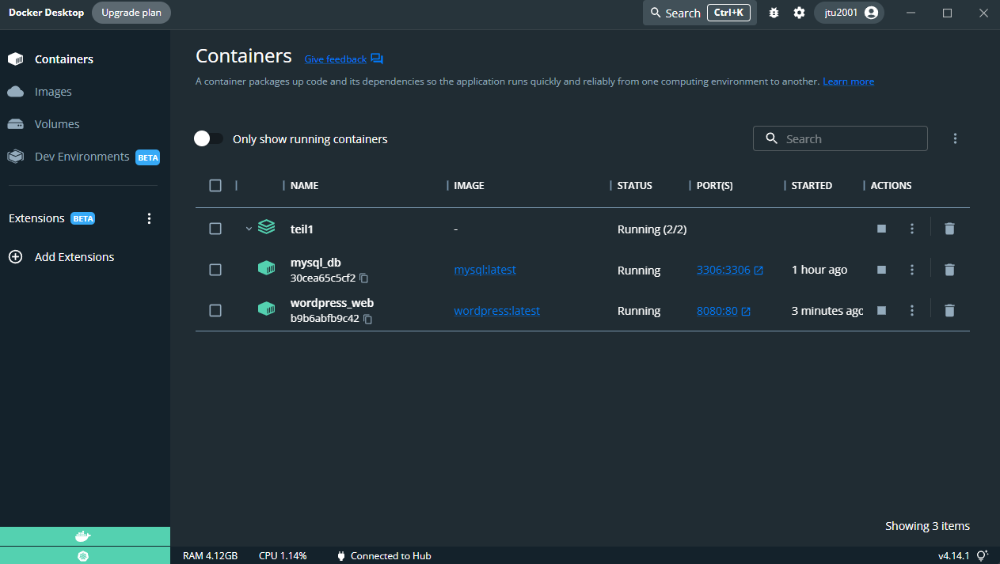
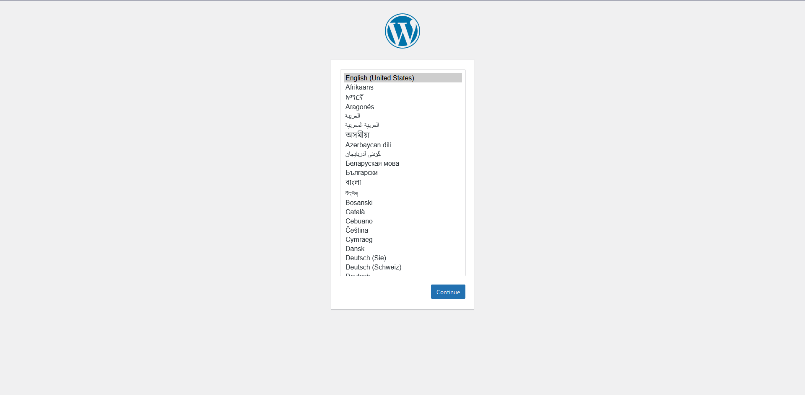
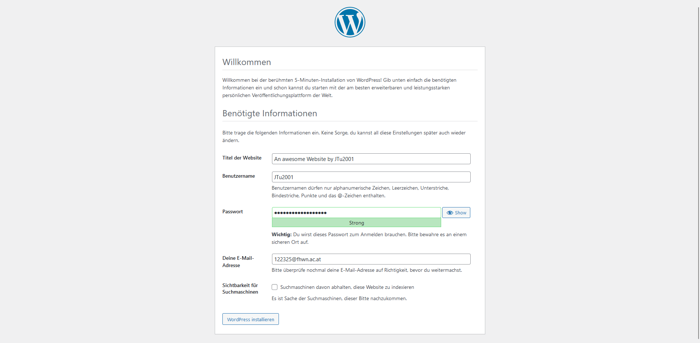
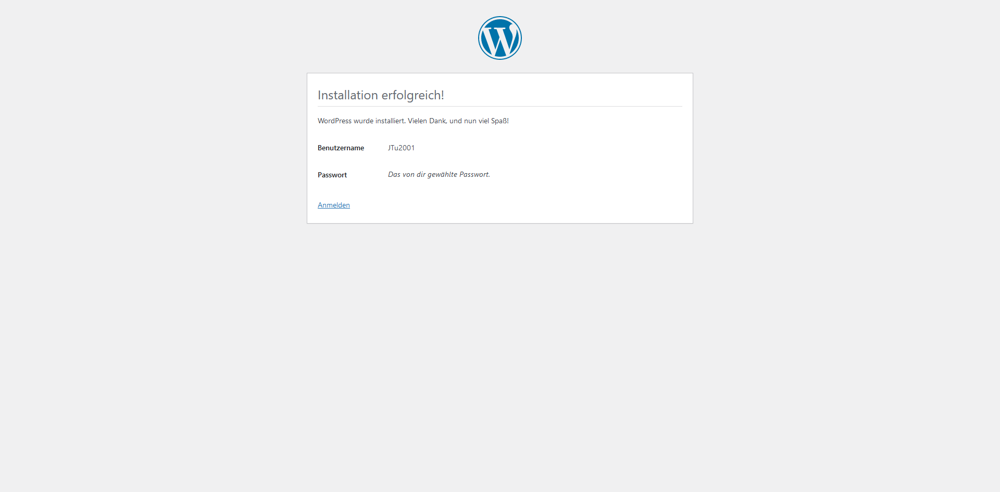
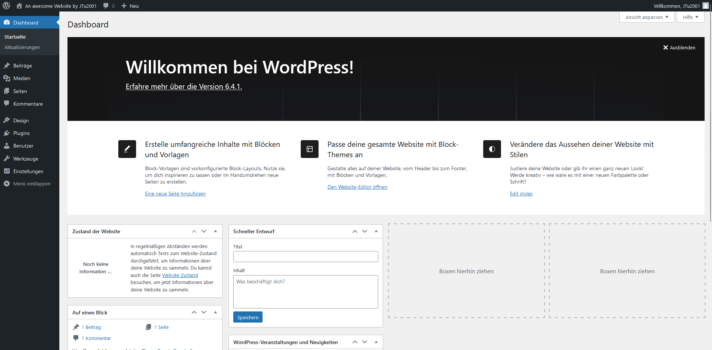

# 1. Teil 1

Dieses Kapitel beschäftigt sich mit `Teil 1` der Aufgabe. Hierbei soll ein `docker-compose`-File erstellt werden welche Wordpress und MySQL images verwendet um eine Wordpress Container infrastruktur aufzusetzen. 

- [1. Teil 1](#1-teil-1)
  - [1.1. Vorbereitung - Container aufsetzen](#11-vorbereitung---container-aufsetzen)
  - [1.2. Setup MySQL Datenbank](#12-setup-mysql-datenbank)
    - [1.2.1. Test der DB](#121-test-der-db)
  - [1.3. Setup Wordpress](#13-setup-wordpress)
  - [1.4. Container anhalten](#14-container-anhalten)


## 1.1. Vorbereitung - Container aufsetzen

Als erstes muss ein File mit dem Namen `docker-compose.yml` erstellt werden. Das `docker-compose.yml`-File hat folgende Struktur (Kommentare in YAML mittels `#`):
```YAML
version: 3 # Hier steht die Version

services: # Hier befinden sich die Services

volumes: # Hier können Volumes angeführt werden 
``` 

## 1.2. Setup MySQL Datenbank

Dieses Kapitel beschäftig sich mit dem Aufsetzen der MySQL Datenbank mittels `docker compose`.
Hierzu soll ein service in das `docker-compose.yml`-File eingefügt werden.
```YAML
version: '3'

services: 
  db_mysql: 
    image: mysql:latest
    container_name: mysql_db
    ports:
      - '3306:3306'
    restart: unless-stopped
    environment:
      - MYSQL_ROOT_PASSWORD=password
      - MYSQL_USER=user
      - MYSQL_PASSWORD=password
      - MYSQL_DATABASE=wordpress
    volumes:
      - mysql-data:/var/lib/mysql

volumes:
  mysql-data:
```
Nähere Informationen zum Image befindet sich [hier](https://hub.docker.com/_/mysql).

Um ein Container gemäß der `docker-compose.yml` Konfiguration zu erstellen, muss folgender Befehl ausgeführt werden:
```
docker-compose up -d
```
<span style="color:lime"> Hinweis: Docker Desktop muss im Hintergrund aktiv sein. </span>

Nach der Ausführung des Befehls sollte der Container im Hintergrund laufen:
<p align="center">
  
</p>


### 1.2.1. Test der DB

Um zu überprüfen ob die Datenbank läuft kann folgender Befehl ausgeführt werden

```
docker exec -it mysql_db mysql -u user -p
```
Wobei für `<CONTAINERNAME>` und `<USER>` die dementsprechenden Werte eingesetzt werden sollen.
- `<CONTAINERNAME>`: Containername für das MySQL Datenbank Service (hier: `mysql_db`)
- `<USER>` der Benutzer der in den `environment` definiert wurde (hier: `user`)

Anschließend wird man aufgefordert das Passwort einzugeben (Definiert unter environment => hier: password).

Anschließend kommt man zum `MySQL monitor`:

<p align="center">
  
</p>

Um zu überprüfen, ob die `wordpress`-Datenbank auch existiert, kann folgender Befehl ausgeführt werden:
```SQL
SHOW DATABASES;
```
Die Ausgabe sollte wie folgt sein:
<p align="center">
  
</p>

## 1.3. Setup Wordpress

Dieses Kapitel beschäftig sich mit dem Aufsetzen der MySQL Datenbank mittels `docker compose`.
Hierzu soll ein service in das `docker-compose.yml`-File eingefügt werden.
```YAML
version: '3'

services: 
  db_mysql: 
    image: mysql:latest
    container_name: mysql_db
    ports:
      - '3306:3306'
    restart: unless-stopped
    environment:
      - MYSQL_ROOT_PASSWORD=password
      - MYSQL_USER=user
      - MYSQL_PASSWORD=password
      - MYSQL_DATABASE=wordpress
    volumes:
      - mysql-data:/var/lib/mysql
    
  wordpress:
    image: wordpress:latest
    container_name: wordpress_web
    ports: 
      - '8080:80'
    environment:
      - WORDPRESS_DB_HOST=db_mysql:3306
      - WORDPRESS_DB_USER=user
      - WORDPRESS_DB_PASSWORD=password
      - WORDPRESS_DB_NAME=wordpress
    volumes:
      - wordpress-data:/var/www/html
      
volumes:
  mysql-data:
  wordpress-data:
```

Nähere Informationen zum Image befindet sich [hier](https://hub.docker.com/_/wordpress).

Anschließend muss erneut folgender Befehl ausgeführt werden um den Container zu starten:
```
docker-compose up -d
```
Nach der Ausführung sollten beide Container laufen:

<p align="center">
  
</p>

Wordpress sollte nun unter [http://localhost:8080](http://localhost:8080) erreichbar sein.

<p align="center">
  
</p>

Anschließend muss man eine Sprache auswählen.

<p align="center">
  
</p>

Danach muss man benötigte Informationen für die Webseite angeben.

<p align="center">
  
</p>

Nachdem den Installationsprozess durchgeführt wurde, muss man sich anmelden.
Anschließend wird man zu dashboard weitergeleitet.

<p align="center">
  
</p>

## 1.4. Container anhalten
Um alle laufenden Container zu stoppen wird folgender Befehl verwendet.

```
docker-compose stop
```