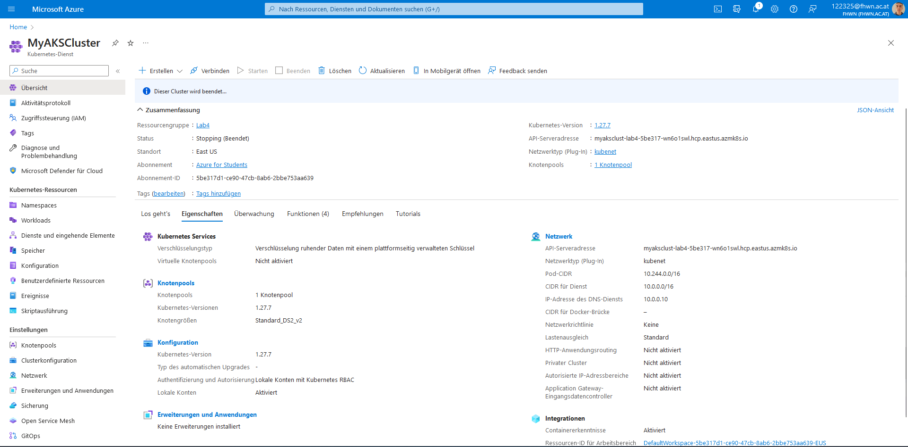
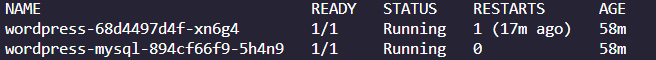
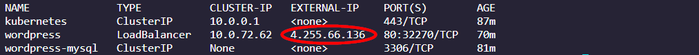
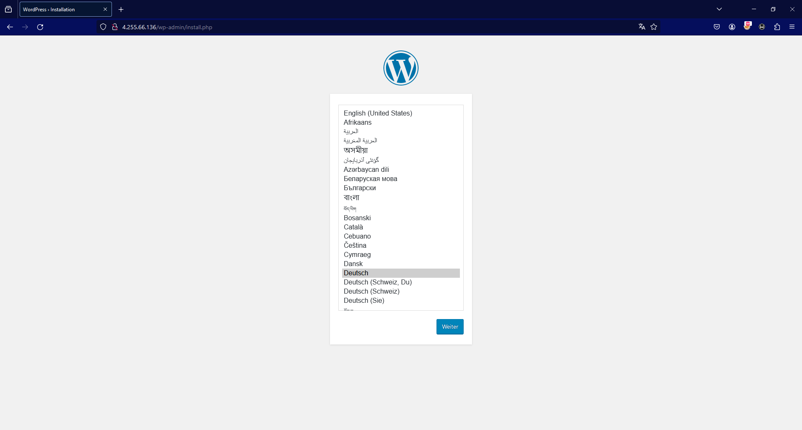

# 1. Inhaltsverzeichnis
- [1. Inhaltsverzeichnis](#1-inhaltsverzeichnis)
- [2. Aufgabenstellung](#2-aufgabenstellung)
  - [2.1. Aufsetzung \& Konfiguration eines AKS in Azure](#21-aufsetzung--konfiguration-eines-aks-in-azure)
    - [2.1.1. Erstellung der Ressourcengruppe](#211-erstellung-der-ressourcengruppe)
    - [2.1.2. Erstellung des AKS](#212-erstellung-des-aks)
    - [2.1.3. Überprüfung](#213-überprüfung)
    - [2.1.4. Löschvorgang](#214-löschvorgang)
  - [2.2. Konfiguration \& Deployment von Wordpress incl. MySQL in AKS cluster](#22-konfiguration--deployment-von-wordpress-incl-mysql-in-aks-cluster)
    - [2.2.1. Konfiguration \& Deployment von MySQL](#221-konfiguration--deployment-von-mysql)
    - [2.2.2. Konfiguration \& Deployment von Wordpress](#222-konfiguration--deployment-von-wordpress)
- [3. Quellen](#3-quellen)


# 2. Aufgabenstellung
Die Aufgabe besteht in erster Linie darin einen AKS in Azure aufzusetzen und zu konfigurieren. Anschließend soll Wordpress und MySQL in ein AKS cluster konfiguriert und deployed werden.

## 2.1. Aufsetzung & Konfiguration eines AKS in Azure
Dieses Kapitel beschäftigt sich mit der Aufsetzung und Konfiguration von AKS in Azure.

### 2.1.1. Erstellung der Ressourcengruppe
Für die erstellung der Resourcengruppe wird folgender Befehl verwendet:
```
az group create --name "Lab4" --location eastus
```
Wobei `Lab4` der Name der Ressourcengruppe ist und `eastus` der Standort.

<span style="color:lime"> Hinweis: Liste mit verfügbaren Standorten kann mittels folgenden Befehl angegeben werden:</span>
```
az account list-locations --output table 
```
Anschließend sollte die Resourcengruppe erstellt werden.

### 2.1.2. Erstellung des AKS

Für die erstellung des AKS wurde folgender Befehl verwendet:
```
az aks create --resource-group "Lab4" --name MeinAKSCluster --node-count 2 --generate-ssh-keys
```
Hier eine kurze Beschreibung vom Command:
- `az aks create`: Erstellung eines AKS-Clusters
- `--resource-group "Lab4"`: Die Ressourcengruppe `Lab4`
- `--node-count 2`: Bestimmt die Anzahl der Nodes im Cluster
- `--generate-ssh-keys`: Zur generierung des SSH-Keys, für Zugriff auf Cluster.

<div align="center">
  
</div>


Nachdem der Cluster erstellt wurde kann auf den Cluster zugegriffen werden:
```
az aks get-credentials --resource-group "Lab4" --name MeinAKSCluster
```

### 2.1.3. Überprüfung
Um Informationen über die verfügbaren Nodes im Cluster zu bekommen wird folgedner Befehl verwendet:
```
kubectl get nodes
```
Um eine Liste von Pods in ein Cluster anzuzeigen wird folgender Befehl verwendet:
```
kubectl get pods
```
Und für eine Liste mit allen Deployments: 
```
kubectl get deployment
```

### 2.1.4. Löschvorgang
Um jeweils die `deployments`, `services` und `pods` zu löschen sind folgende Befehle zu verwenden: 
```
kubectl delete deployments --all
```
```
kubectl delete services --all
```
```
kubectl delete pods --all
```


## 2.2. Konfiguration & Deployment von Wordpress incl. MySQL in AKS cluster
Dieses Kapitel beschäftigt sich mit der Konfiguration und Deployment von Wordpress und MySQL in ein Cluster.

### 2.2.1. Konfiguration & Deployment von MySQL
Hierbei wurde zuerst das MySQL-deployment-File mit den Namen `mysql.deployment.yaml` erstellt:
```YAML
apiVersion: v1
kind: Service
metadata:
  name: wordpress-mysql
  labels:
    app: wordpress
spec:
  ports:
    - port: 3306
  selector:
    app: wordpress
    tier: mysql
  clusterIP: None

---
apiVersion: v1
kind: PersistentVolumeClaim
metadata:
  name: mysql-pv-claim
  labels:
    app: wordpress
spec:
  accessModes:
    - ReadWriteOnce
  resources:
    requests:
      storage: 20Gi

---
apiVersion: apps/v1 
kind: Deployment
metadata:
  name: wordpress-mysql
  labels:
    app: wordpress
spec:
  selector:
    matchLabels:
      app: wordpress
      tier: mysql
  strategy:
    type: Recreate
  template:
    metadata:
      labels:
        app: wordpress
        tier: mysql
    spec:
      containers:
        - image: mysql:5.6
          name: mysql
          env:
            - name: MYSQL_ROOT_PASSWORD
              valueFrom:
                secretKeyRef:
                  name: mysql-pass
                  key: password
          ports:
            - containerPort: 3306
              name: mysql
          volumeMounts:
            - name: mysql-persistent-storage
              mountPath: /var/lib/mysql
      volumes:
        - name: mysql-persistent-storage
          persistentVolumeClaim:
            claimName: mysql-pv-claim
```
Dieses YAML-Datei definiert verschiedene Kubernetes-Ressourcen, um eine MySQL-Datenbank für eine WordPress-Anwendung bereitzustellen, konkret `deployment`, `services` und `PersistentVolumeClaims`.

Nach dem das File erstellt wurde, muss ein secret definiert werden mittels:
```
kubectl create secret generic mysql-pass --from-literal=password='<YOURPASSWORDHERE>'
```
Hier eine kurze Beschreibung zum Befehl:
- `kubectl create secret generic`: Erstelle ein secret in form eines Key/Value Pairs, welches im deployment-File dann verwendet wird
- `mysql-pass`: Der `Key`
- `--from-literal=password='<YOURPASSWORDHERE>'`: Der `Value`.


Wobei `<YOURPASSWORDHERE>` durch das gewünschte passwort ersetzt werden sollte.

Nach dem das secret erstellt wurde kann folgender Befehl verwendet werden um zu überprüfen, ob das secret tatsächlich auch existiert:
```
kubectl get secret
```
<div align="center">
  
</div>

Nach dem das Secret erstellt wurde, muss das `mysql-deployment.yaml` File am Custer angewandt werden.
```
kubectl apply -f mysql-deployment.yaml
```
Auch hier sollte überpüft werden ob das Deployment, Sevice und PersistentVolume existieren mittels:
Für Persistent Volmes:
```
kubectl get pvc
```
Für Deployments:
```
kubectl get deployments
```
Für Services:
```
kubectl get services
```

### 2.2.2. Konfiguration & Deployment von Wordpress
Auch wie im vorherigen Abschnitt wird hier ein YAML-File definiert, mit dem Namen `wordpress-deployment.yaml`:
```YAML
apiVersion: v1
kind: Service
metadata:
  name: wordpress
  labels:
    app: wordpress
spec:
  ports:
    - port: 80
  selector:
    app: wordpress
    tier: frontend
  type: LoadBalancer

---
apiVersion: v1
kind: PersistentVolumeClaim
metadata:
  name: wp-pv-claim
  labels:
    app: wordpress
spec:
  accessModes:
    - ReadWriteOnce
  resources:
    requests:
      storage: 20Gi

---
apiVersion: apps/v1 
kind: Deployment
metadata:
  name: wordpress
  labels:
    app: wordpress
spec:
  selector:
    matchLabels:
      app: wordpress
      tier: frontend
  strategy:
    type: Recreate
  template:
    metadata:
      labels:
        app: wordpress
        tier: frontend
    spec:
      containers:
        - image: wordpress:4.8-apache
          name: wordpress
          env:
            - name: WORDPRESS_DB_HOST
              value: wordpress-mysql
            - name: WORDPRESS_DB_PASSWORD
              valueFrom:
                secretKeyRef:
                  name: mysql-pass
                  key: password
          ports:
            - containerPort: 80
              name: wordpress
          volumeMounts:
            - name: wordpress-persistent-storage
              mountPath: /var/www/html
      volumes:
        - name: wordpress-persistent-storage
          persistentVolumeClaim:
            claimName: wp-pv-claim
```

Anschließend wenden wir das Deployment am Cluster an:
```
kubectl apply -f wordpress-deployment.yaml
```
Nachdem das durchgeführt wurde kann wieder `kubectl get pods` verwendet werden, um die Pods darzustellen:
<div align="center">
  
</div>

Um herauszufinden, wo man auf die wordpressseite zugreifen kann, wird `kubectl get services` verwendet um die `EXTERNAL-IP` zu bestimmen:
<div align="center">
  
</div>

Die Worpress seite sollte nun unter der External-IP erreichbar sein:

<div align="center">
  
</div>

# 3. Quellen

[Quickstart: Deploy an Azure Kubernetes Service (AKS) cluster using Azure portal](https://docs.microsoft.com/en-us/azure/aks/kubernetes-walkthrough)

[Deploy MySQL and WordPress on Azure Kubernetes Service (AKS)](https://www.buchatech.com/2019/01/deploy-mysql-and-wordpress-on-azure-kubernetes-service-aks/)


